# StudioX

A marketing/static UI website for the `ATELIER NORTH` studio concept, built with React Router 7, React 19, TypeScript, and Tailwind CSS 4.

This project is currently structured around:
- thin `routes` focused on routing and SEO metadata
- `features` for page-level UI
- `content` for static JSON data
- `shared` for layout, header/footer, SEO helpers, and site-wide config

Note: this is a **static UI mock**. There is no real backend or API integration yet. Forms, newsletter inputs, and share/bookmark actions are currently visual-only.

## Tech Stack

- `React 19` + `react-dom` for the UI layer and client rendering
- `React Router 7` in framework mode for route modules, metadata, and static prerendering
- `Vite 8` with `@react-router/dev` for local development and production builds
- `TypeScript 5` for typed routes, shared helpers, and content models
- `Tailwind CSS 4` via `@tailwindcss/vite` for styling
- `ESLint 9` with TypeScript and React plugins for code quality checks
- `Yarn` for package management and CI commands
- `GitHub Actions` for building, uploading to S3, and invalidating CloudFront

## Running The Project

### 1. Install dependencies

```bash
yarn install
```

### 2. Start the dev server

```bash
yarn dev
```

### 3. Build for production

```bash
yarn build
```

### 4. Preview the production build

```bash
yarn preview
```

## GitHub Actions Deploy To S3

This repo includes a workflow at `.github/workflows/deploy-s3.yml` that:

- runs on every push to `main`
- builds the static site with `yarn build`
- uploads the generated files from `build/client` to `s3://<bucket>/site/`
- invalidates the target CloudFront distribution after upload

Before using it, configure these GitHub repository settings:

- `Secrets`: `AWS_ACCESS_KEY_ID`, `AWS_SECRET_ACCESS_KEY`, `AWS_REGION`, `AWS_S3_BUCKET`, `AWS_CLOUDFRONT_DISTRIBUTION_ID`

In the current workflow, `AWS_CLOUDFRONT_DISTRIBUTION_ID` should point to the site distribution. The images distribution is expected to be managed separately or by another workflow if you also want automated invalidation for image assets.

You can also run the workflow manually from the `Actions` tab with `workflow_dispatch`.

## S3 And CloudFront Setup

The recommended production setup for this repo is:

- keep one S3 bucket private
- store website files under the `site/` prefix
- store shared image assets under the `images/` prefix
- use one CloudFront distribution for the site and a second CloudFront distribution for images
- let the site distribution rewrite clean URLs such as `/about` to `/about/index.html`

### Request And Response Flow

The diagram below shows how a browser request is resolved in production for the prerendered frontend:



At a high level:

- the browser sends the request to CloudFront
- CloudFront rewrites clean URLs and checks the edge cache
- on a cache miss, CloudFront fetches the prerendered file from the private S3 origin
- CloudFront caches the origin response and returns the final response to the browser

### S3 Configuration

For a private S3 origin setup:

- create or reuse one S3 bucket in your target region
- keep `Block all public access` turned on
- use `Bucket owner enforced` for object ownership if available
- upload site files only through CI or trusted AWS credentials
- you do not need `Static website hosting` when using private S3 with OAC

The GitHub Actions workflow uploads to:

```text
s3://<AWS_S3_BUCKET>/site/
```

The bucket layout is expected to look like this:

```text
s3://<AWS_S3_BUCKET>/
├── site/
│   ├── index.html
│   ├── about/index.html
│   └── assets/...
└── images/
    ├── hero-01.jpg
    └── brand/logo.svg
```

Use a bucket policy that allows the site distribution to read `site/*` and the images distribution to read `images/*`:

```json
{
  "Version": "2012-10-17",
  "Statement": [
    {
      "Sid": "AllowSiteDistributionReadSitePrefix",
      "Effect": "Allow",
      "Principal": {
        "Service": "cloudfront.amazonaws.com"
      },
      "Action": "s3:GetObject",
      "Resource": "arn:aws:s3:::YOUR_BUCKET_NAME/site/*",
      "Condition": {
        "StringEquals": {
          "AWS:SourceArn": "arn:aws:cloudfront::YOUR_ACCOUNT_ID:distribution/YOUR_SITE_DISTRIBUTION_ID"
        }
      }
    },
    {
      "Sid": "AllowImagesDistributionReadImagesPrefix",
      "Effect": "Allow",
      "Principal": {
        "Service": "cloudfront.amazonaws.com"
      },
      "Action": "s3:GetObject",
      "Resource": "arn:aws:s3:::YOUR_BUCKET_NAME/images/*",
      "Condition": {
        "StringEquals": {
          "AWS:SourceArn": "arn:aws:cloudfront::YOUR_ACCOUNT_ID:distribution/YOUR_IMAGES_DISTRIBUTION_ID"
        }
      }
    }
  ]
}
```

### Site CloudFront Distribution

Create the site distribution against the regular S3 bucket origin, not the S3 website endpoint:

- `Origin domain`: `YOUR_BUCKET_NAME.s3.<region>.amazonaws.com`
- `Origin path`: `/site`
- `Origin access`: `Origin access control settings (recommended)`
- `Signing behavior`: `Sign requests`
- `Default root object` must be `index.html`
- `Path pattern`: `Default (*)`
- `Viewer protocol policy`: `Redirect HTTP to HTTPS`
- `Allowed methods`: `GET, HEAD`
- `Compress objects automatically`: `On`
- do not use the `s3-website-...amazonaws.com` endpoint for this private setup
- `Origin path` must be `/site`, not `/*`
- do not prefix the default root object with `/`

### Images CloudFront Distribution

Create a second distribution for images that points to the same private S3 bucket:

- `Origin domain`: `YOUR_BUCKET_NAME.s3.<region>.amazonaws.com`
- `Origin path`: `/images`
- `Origin access`: `Origin access control settings (recommended)`
- `Signing behavior`: `Sign requests`
- `Path pattern`: `Default (*)`
- `Viewer protocol policy`: `Redirect HTTP to HTTPS`
- `Allowed methods`: `GET, HEAD`
- `Compress objects automatically`: `On`

With this setup, an image URL such as:

```text
https://images.example.com/hero-01.jpg
```

maps to:

```text
s3://<AWS_S3_BUCKET>/images/hero-01.jpg
```

### CloudFront Function For Clean URLs

Because the site is static and stored as `about/index.html`, the site distribution should rewrite requests before they reach S3.

Create a CloudFront Function and associate it with the `Viewer request` event on the site distribution's `Default (*)` behavior:

```js
function handler(event) {
    var request = event.request;
    var uri = request.uri;

    if (uri.endsWith('/')) {
        request.uri += 'index.html';
    } else if (!uri.includes('.')) {
        request.uri += '/index.html';
    }

    return request;
}
```

This maps:

- `/` -> `/index.html`
- `/about` -> `/about/index.html`
- `/about/` -> `/about/index.html`

Make sure the function is published to `LIVE` before associating it with the distribution.

### Manual Verification Checklist

After the first deployment:

- confirm `build/client/index.html` exists locally after `yarn build`
- confirm S3 contains `site/index.html` and nested route files such as `site/about/index.html`
- confirm S3 contains image assets under `images/`
- confirm the site CloudFront `Default root object` is `index.html`
- confirm the site CloudFront function is associated with `Viewer request`
- open `/`, `/about`, and one blog detail route from the site CloudFront domain
- open one asset such as `/hero-01.jpg` from the images CloudFront domain
- if CloudFront serves stale site content, create an invalidation for the site distribution

### Useful AWS References

- [Restrict access to an Amazon S3 origin](https://docs.aws.amazon.com/AmazonCloudFront/latest/DeveloperGuide/private-content-restricting-access-to-s3.html)
- [Specify a default root object in CloudFront](https://docs.aws.amazon.com/AmazonCloudFront/latest/DeveloperGuide/DefaultRootObject.html)
- [Customize at the edge with CloudFront Functions](https://docs.aws.amazon.com/AmazonCloudFront/latest/DeveloperGuide/cloudfront-functions.html)
- [CloudFront Functions event structure](https://docs.aws.amazon.com/AmazonCloudFront/latest/DeveloperGuide/functions-event-structure.html)

## Scripts

```json
{
  "dev": "react-router dev",
  "build": "tsc -b && react-router build",
  "lint": "eslint .",
  "preview": "npx serve build/client"
}
```

## Folder Structure

```text
.
├── public/                    # favicon, robots.txt, sitemap.xml, public assets
├── src/
│   ├── content/               # static JSON content for pages/blog posts
│   ├── features/              # feature/page-based UI modules
│   │   ├── about/
│   │   ├── blog/
│   │   ├── blog-post/
│   │   ├── contact/
│   │   ├── home/
│   │   ├── pricing/
│   │   ├── services/
│   │   └── work/
│   ├── routes/                # route entry files
│   ├── shared/
│   │   ├── components/        # PageFrame, SiteHeader, SiteFooter
│   │   ├── content/           # shared site config/content
│   │   ├── hooks/             # useSiteShell
│   │   └── types/             # shared types
│   ├── entry.client.tsx
│   ├── root.tsx
│   ├── routes.ts
│   └── index.css
├── build/                     # build/prerender output
├── .react-router/             # generated React Router files
├── package.json
├── react-router.config.ts
└── vite.config.ts
```

## Routing

Current main routes:

- `/`
- `/about`
- `/services`
- `/work`
- `/pricing`
- `/blog`
- `/blog/:slug`
- `/contact`

The project is configured with:

- `ssr: false`
- prerendering for core pages and selected static blog posts

See `react-router.config.ts`.

## Data Flow

Most pages follow this flow:

1. Route file in `src/routes/*`
2. Hook in `src/features/<feature>/hooks/*`
3. View component in `src/features/<feature>/components/*`
4. Static data from `src/content/*.json`

Example:

- `src/routes/home.tsx`
- `src/features/home/hooks/useHomePage.ts`
- `src/features/home/components/HomePageView.tsx`
- `src/content/home.json`

## Where To Edit Content

To update text or images, edit the relevant files in:

- `src/content/home.json`
- `src/content/about.json`
- `src/content/services.json`
- `src/content/work.json`
- `src/content/pricing.json`
- `src/content/blog.json`
- `src/content/blog-posts.json`
- `src/content/contact.json`

To update the shared site shell:

- `src/shared/content/siteConfig.ts`

## SEO And Prerendering

SEO metadata is defined per route with helpers from:

- `src/shared/seo.ts`

Canonical links and Open Graph metadata are generated from static content. Since this is a static site, adding a new page or blog post usually means updating:

- the content file
- the related route
- the prerender list in `react-router.config.ts`

## Development Notes

- `build/` is output, not source code.
- `.react-router/` is generated.
- The shared site shell now goes through `PageFrame` + `siteConfig`.
- Some UI interactions are intentionally mock-only for visual presentation and are not complete product flows.

## Good Next Steps

- Connect the `contact` form to a real API
- Add schema validation for JSON content
- Unify brand/content naming if you want the entire site to use a single identity
- Replace or optimize source images for large hero sections
